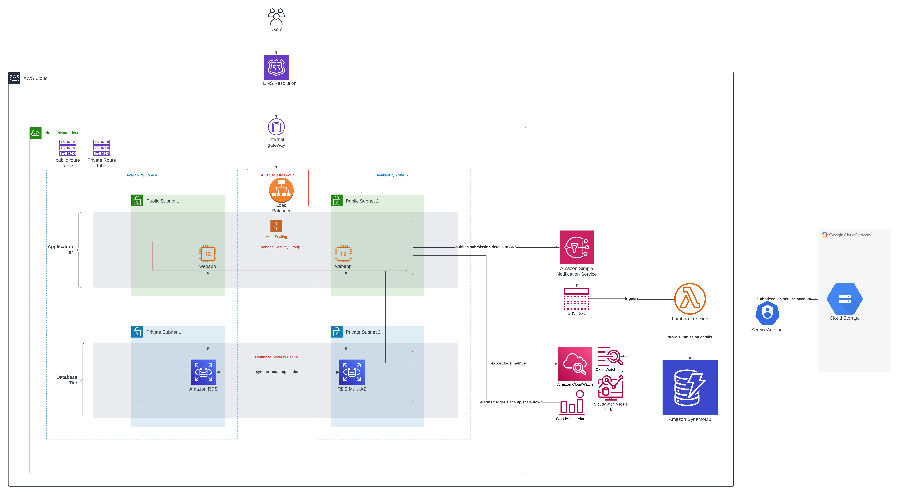

# Cloud-Native Web Application
This repository hosts the source code of a cloud-native backend web application based on SpringBoot framework in Kotlin, built iteratively for the *CSYE-6225* graduate course titled **Network Structures and Cloud Computing** at Northeastern University in the Fall 2023 semester.

Swagger specification can be found here: [https://gouthamhusky.github.io/WebApp/](https://gouthamhusky.github.io/WebApp/)
## Technological Specifications

The application leverages the following technologies, frameworks, SDKs and runtimes:

1. Java Development Kit (JDK) 17 or higher
2. SpringBoot v3.1.4
3.  Hibernate ORM v6.2.0.Final
4. MariaDB Java Client v3.2.0
5. Java StatsD client v3.1.0
6. AWS Java SDK for SNS v1.12.592
7. Gradle

## Architecture





## Overview

1. Clone the repo into your local file system

2. Configure MariaDB as the Database for the application:


- For now, the DB credentials are hard-code and reside in the `application.properties` file located in the `src/main/resources` directory of the app. However, they can be overridden at runtime through command line arguements

- These are the DB specific properties:

```properties  
  
spring.datasource.url=jdbc:mariadb://localhost:3306/yourdb  
spring.datasource.username=username  
spring.datasource.password=password  
```  

Specify the complete file location to load users into accounts table

```properties  
application.config.csv-file=${USERS_CSV:users.csv}  
```  

## Build


To build the Spring Boot application, use the following Gradle command:


```bash  
.gradlew clean build -xTest  
```  


## Run


### Docker Compose to bring up the DB


A Docker Compose file is available in the root of the application path to boot up a MariaDB instance via Docker runtime. To use Docker Compose, follow these steps:

1. Ensure Docker host is up and running in your system

2. Execute the following command from the root of the application:

```bash  
  
docker-compose up  
  
```  

This will spin up a MariaDB instance on your local machine


### Gradle run


To run the application using Gradle, execute the following command:


```bash  
./gradlew  bootRun  
```  

**Note**: The DB must be up before starting the application, else it will crash due to Hibernate exceptions. The DB must always be in a healthy state prior to application start.

One the app starts successfully,  it can be accessed at the following address: `http://localhost:8080`.


## Local integration test


[Karate](https://github.com/intuit/karate) tests can be executed via the following command, which tests the application's health endpoint :


```bash  
  
gradle  test  
  
```  

## Miscellaneous

Import SSL certification to AWS ACM through the following command:
```bash  
aws acm import-certificate --certificate file://<filepath> --private-key fileb://<filepath>  
```  


## License


This repository uses MIT License. See the [LICENSE](LICENSE) file for details.